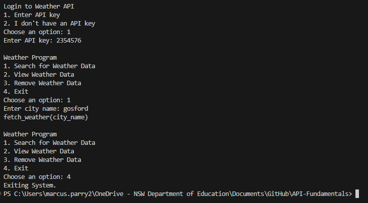

# Requirements Definition
## Functional Requirements
(What the system should do)

- Data Retrieval:
The user must be able to view the terminal and options in the program. Once the data is retrieved, the user must be able to view the data that was requested.
- User Interface:
The user must be able to use the terminal to interact with the program and request data. The user must also install all dependencies required for the program to function. All required dependencies are listed in the 'requirements.txt' file.
- Data Display:
The user must be able to retrieve any requested information from the API and have it displayed in the terminal.
## Non-Functional Requirements
(How the system should work)

- Performance:
The system must be able to efficiently retrieve information from an API with minimal data usage and consistently high speed.
- Reliability:
The system must be able to always retrieve requested data and display the most up-to-date version of that data.
- Usability and Accessibility:
The system must be simple and easy to navigate to minimise confusion from the user. Instructions for what dependencies need to be installed and how the system functions will be required for the user to access the system.
# Determining Specifications
## Functional Specifications
- User Requirements:
The user must be able to interact with the system's terminal, make requests to retrieve data from an API, request to display the data retrieved in a user interface, and end all operations of the program.
- Inputs & Outputs:
The system must be able to accept inputs of several words and numbers to use for requests. The system must be able to display outputs of retrieved data as strings of letters and numbers.
- Core Features:
The program must be able to receive requests from the user and retrieve data from an API that fulfills the required information requested.
- User Interaction:
The system will use a GUI (Graphical User Interface) for the user to interact with the system. The system will display options that the user can select to navigate between each function.
- Error Handling:
Mistyped requests must be able to be corrected and not end syatem operations.
## Non-Functional Specifications
- Performance:
The system should be able to perform tasks within a few seconds of a request being sent. Efficiency can be improved by reducing the amount of code that the system is required to use to fulfill user requests.
- Useability / Accessibility:
The accessibility of the system can be improved by reducing the amount of requests that need to be made to retrieve data.
- Reliability:
Data integrity will need to be adressed as outdated data would render the system purposeless.
# Design
## Gantt Chart
https://lucid.app/lucidspark/d4873ae8-ff3f-440d-bd43-b97a3c7136c3/edit?invitationId=inv_4b4ff063-5e29-4f2e-9794-8420ab63644a
## Structure Chart
https://lucid.app/lucidchart/1d3257fd-c981-4891-978d-e0262e1de5c4/edit?invitationId=inv_509bc7ad-de1f-44f9-b586-6b2d87372d52
## Algorithms
https://lucid.app/lucidchart/a5dbf18d-f1fe-4879-a1ec-e520016d7ee4/edit?invitationId=inv_5f577885-567c-4f24-8f82-ee6d982ad34f
## Data Dictionary
Variables: api_key, base_url, complete_url, response, location, region, country, temperature, condition
# Development

# Integration
The code functions appropriately, but does not meet requirements.
# Testing and Debugging
Loading time of the code is low. The code does not meet the requirements listed in Requirements Definition. requirements.txt only has the requests module, which is the only module used in the program. The README.md is poor in quality, as it only provides a rough explanation of what the program does.
# Maintenance
Maintenance would play a major role in the continuation of this project. Many functions and variables don't work as intended, and further work would render the program as useful.
# Total Evaluation
Despite my efforts to get this code to work, I couldn't figure out how to make the weather API work. I'm disappointed as I wished to make a program that would meet the requirements I set out for myself, but my efforts were ultimately in vain. Overall, if I put more time and effort into this project, I would probably have a product of passable quality, but in the state that this program is in now, it's impossible for me to improve upon it in the limited time I left for myself.